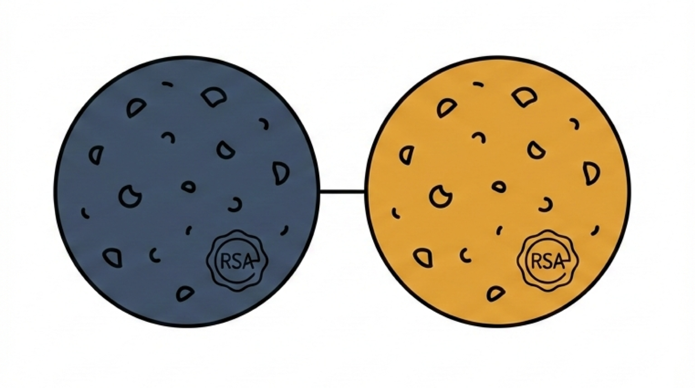

# CSRF Protection with a Signed Double-Submit Cookie



## The Problem

CSRF (Cross-Site Request Forgery) tricks a user's browser into making a request to a site where they're already authenticated. Because the browser automatically attaches cookies, the target server can't tell if a request is legitimate or forged by looking at the cookies.

The classic fix is the double-submit cookie pattern: set a token in a readable cookie, have JavaScript read it and send it in a custom header, then verify on the server that the cookie and header values match. An attacker can trigger a request but can't read the cookie from a different origin, so they can't set the matching header.

This works fine for a monolith. The problem shows up in distributed systems.

If you sign the CSRF token with HMAC (which most libraries do), every service that needs to validate it must share the same secret key. This means distributing a symmetric key across all backend services, and rotating it requires coordinated redeployment. As services grow, this becomes an operational problem.

There's a better approach if you already have JWT-based auth in place.

## The Solution: JWT-Bound CSRF Tokens Signed with RSA

The core idea: structure the CSRF token as a JWT, sign it with the auth server's RSA private key, and bind it to the user's access token via the `jti` claim.

Two cookies are set on login:

  - **Access token cookie** — the JWT access token, HTTP-only and Secure (not readable by JavaScript)
  - **CSRF cookie** — a signed CSRF token in JWT format, readable by JavaScript (not HTTP-only)

For every state-changing request (POST, PUT, DELETE), the frontend reads the CSRF token from the cookie and attaches it as a custom header:

```
X-XSRF-TOKEN: <csrf_token>
```
The browser sends both cookies automatically. The server receives the cookies plus the explicit header value and validates all three together.

## Token Format

The CSRF token is a standard JWT string:

```
<base64url-header>.<base64url-payload>.<base64url-signature>
```
**Header**

```json
{
  "alg": "RS256",
  "typ": "JWT",
  "kid": "key-id"
}
```
`kid` identifies which public key to use for verification. This is the same mechanism used for auth JWTs and enables key rotation through a JWKS endpoint without changing service configuration.

**Payload**

```json
{
  "csrf_token": "<random_value>",
  "jti": "<access_token_jwt_id>",
  "iat": 1700000000,
  "exp": 1700003600,
  "iss": "https://auth.example.com"
}
```
The fields:

  - `csrf_token` — a random value generated at login or token refresh. This is echoed in the `X-XSRF-TOKEN` header.
  - `jti` — the JWT ID of the corresponding access token. This binds the CSRF token to a specific session.
  - `iat` / `exp` — standard issuance and expiration timestamps.
  - `iss` — the issuer URL, used to prevent tokens from one environment being accepted in another.

**Signature**

The payload is signed with the auth server's RSA private key (RS256). Any downstream service can verify this signature using the public key from the JWKS endpoint. No shared secret is required.

## How It Works

### 1. Login / Token Issuance

When a user logs in, the auth server:

  1. Issues a JWT access token (set as an HTTP-only cookie)
  2. Generates a random `csrf_token` value
  3. Creates a CSRF JWT containing that value and the access token's `jti`
  4. Signs the CSRF JWT with its RSA private key
  5. Sets the CSRF JWT as a readable cookie (not HTTP-only)

The same process repeats on token refresh.

### 2. Making Requests

On every state-changing request, the frontend reads the CSRF token from the CSRF cookie and adds it to the request header:

```
X-XSRF-TOKEN: <csrf_token value from the CSRF JWT payload>
```
The browser automatically sends both cookies. The server receives the cookie pair plus the explicit header value.

### 3. Backend Validation

The server validates the CSRF protection in order:

**Step 1 — Extract the access token's `jti`**

Decode the access token from the HTTP-only cookie and extract the `jti` claim.

**Step 2 — Parse and verify the CSRF JWT**

Grab the CSRF JWT from the cookie. Decode the header to extract the `kid`, use it to select the correct public key from the JWKS, and verify the RSA signature. A tampered or forged token fails here.

**Step 3 — Validate standard claims**

Confirm the JWT is not expired (`exp`), the issuer matches the expected value (`iss`), and optionally check `iat` for freshness.

**Step 4 — Verify session binding**

Compare the `jti` from the access token to the `jti` claim in the CSRF JWT. They must match. This prevents an attacker from taking a valid CSRF token from one session and using it in another.

**Step 5 — Verify the CSRF token value**

Compare the `csrf_token` claim from the CSRF JWT payload to the value sent in the `X-XSRF-TOKEN` header. They must match. This is the core double-submit check.

**PASS** If all five checks pass, the request proceeds.

**FAIL** If any check fails, the access token cookie is cleared, and the client is redirected to re-authenticate. This prevents silent session continuation after a detected tampering attempt.

## Why This Works

The design gives you three properties that are hard to achieve together with simpler approaches:

**Independent verification without shared secrets.** Because the CSRF token is signed with an asymmetric RSA key, any service can verify it using the public key from the JWKS endpoint. There is no symmetric secret to distribute or rotate across services. This scales to any number of backends.

**Session binding.** The `jti` claim ties the CSRF token to a specific access token. Even if an attacker obtains a valid CSRF token from another session, it won't validate against a different user's access token.

**No new infrastructure.** If you're already using JWT-based auth with RS256 and a JWKS endpoint, you have everything needed to implement this. The CSRF token is just a second JWT signed with the same key infrastructure. No new libraries, no new services.

The tradeoff is that CSRF tokens are slightly heavier than a plain random string. For most applications this is irrelevant, but it's worth noting if you're sending high volumes of requests.
