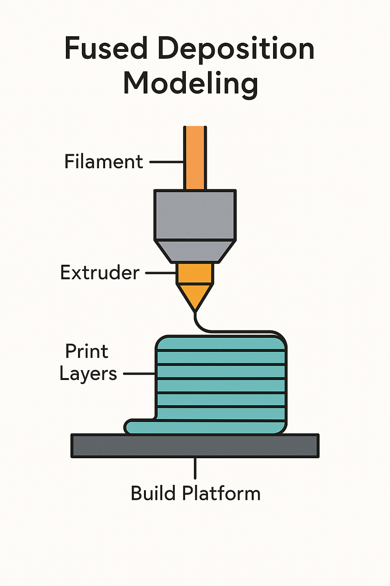
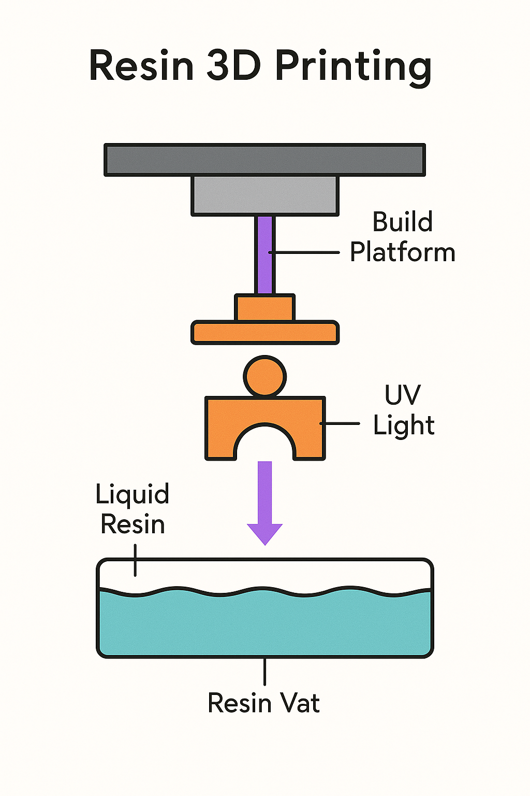
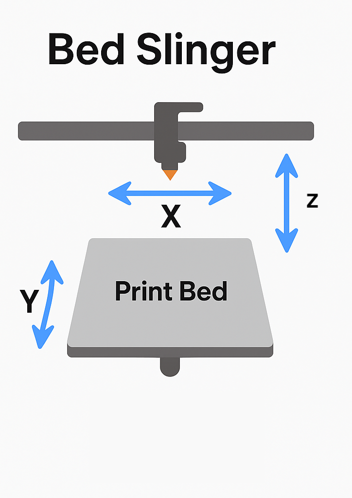
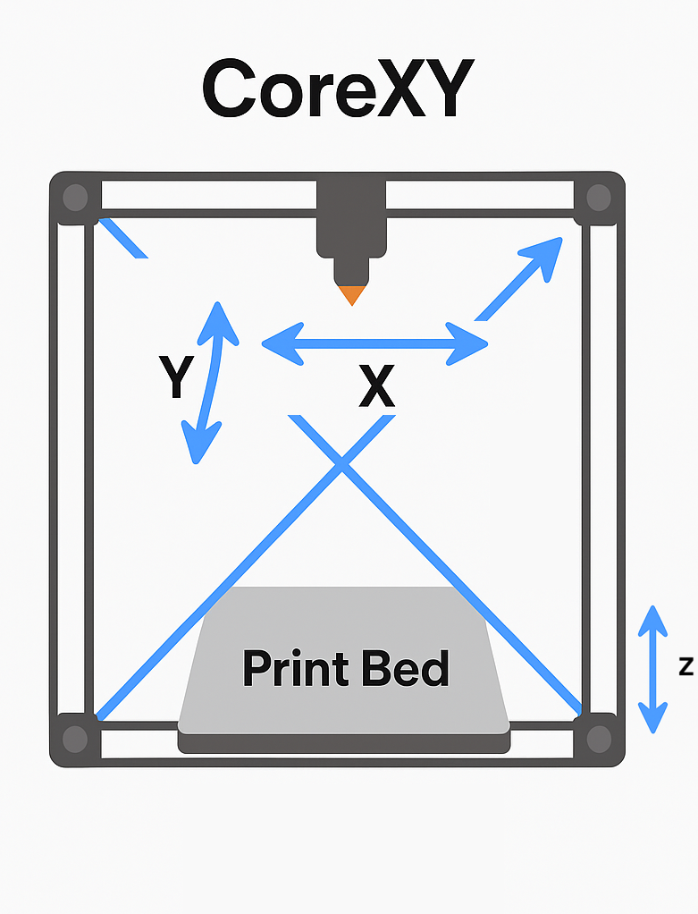

# Agenda

1. Intro
1. Types of Home 3D Printers
1. Finding Models to Print
1. Designing Your Own
1. Common Problems & Troubleshooting
1. Live Demo – Let’s print something!
1. Q&A

# Intro

1. 1980s
1. 2005 RepRap project by Adrian Bowyer
1. 2010 Josef Prusa joined the RepRap project
1. 2012 Josef Prusa founded Prusa 3D
1. 2020 Bambu Lab founded by DJI engineers
1. 2022 Bambu Lab release X1 (coreXY)

# Types of Home 3D printer

::: columns

:::: column

## Fused Deposition Modeling (FDM)

- Materials: PLA, PETG, ABS, PC, mixes with carbon fiber and glass fiber.

Pros:

- Low cost
- Easy to use
- Stronger mechanical parts (not PLA)

Cons:

- Lower resolution/detail (not suitable for tiny details)
- Warping/shrinking

::::

:::: column

::::

:::

# Types of Home 3D printer

::: columns

:::: column
## Resin

Pros

- High resolution and detail

Cons

- Messy and toxic
- Smaller build volume
- Requires ventilation

::::

:::: column

::::

:::

# Types of Home 3D printer

::: columns

:::: column
## Bed Slinger

Pros:

- Simple and cost-effective design
- Easy to understand and maintain
- Great for beginners

Cons:

- Wobble
- Slower printing speed
- Take up a lot of space

::::

:::: column

::::

:::

# Types of Home 3D printer

::: columns

:::: column
## CoreXY

Pros:

- Very stable at high speeds
- Compact footprint for the print volume
- Better quality printing for tall models
- Comes with enclosure (not all models)

Cons:

- High cost
- More complex mechanics

::::

:::: column

::::

:::

# Types of Home 3D printer

Which Brands?

- Prusa
- Bambu Lab

# Finding Models to Print

- Prusa [www.printables.com](https://www.printables.com/)
- Bambu Lab [makerworld.com](https://makerworld.com/)
- Thangs [thangs.com](https://thangs.com/)
- *Thingiverse [thingiverse.com](https://www.thingiverse.com/)

# Designing Your Own

::: columns

:::: column
## Modeling softwares:

- Blender
- Fusion 360
- Tinkercad
- Freecad
- OpenSCAD

::::

:::: column
## Types:

 - Polygonal or mesh
 - Parametric
 - non-parametric

::::

:::

# Common Problems & Troubleshooting

Even new printers can fail sometimes, you need to be ready for troubleshooting.

::: columns

:::: column

## Common issues

- First layer not sticking
- Warping or curling
- Stringing or blobs
- Layer shifts
- Under-extrusion or clogs

::::

:::: column
## Troubleshooting tips

- Wash the bed with dish soap
- For anything else than PLA, you need enclosure to avoid warping
- Keep the filament dry
- Bed leveling and nozzle distance
- Use of slicer preview to catch issues before printing
- Trial and error mindset—it's part of the fun

::::

:::

# Where to start

Slicer Software Tutorials

- [ItsMeaDMaDe](https://www.youtube.com/@ItsMeaDMaDe)

Functional 3D Printing

- [MakersMuse](https://www.youtube.com/@MakersMuse)
- [slant3d](https://www.youtube.com/@slant3d)
- [NeedItMakeIt](https://www.youtube.com/@NeedItMakeIt)

More about materials

- [MyTechFun](https://www.youtube.com/@MyTechFun)
